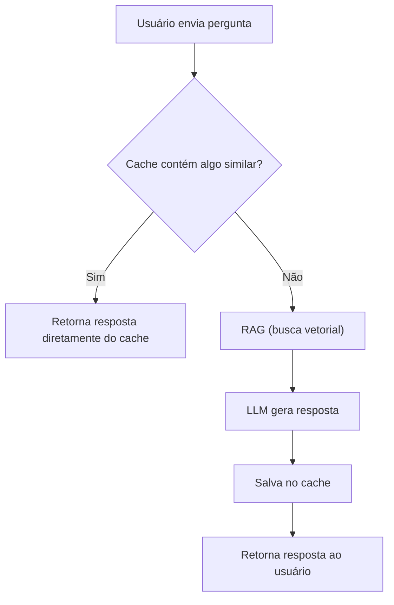

# 🤖 Gemini - Guia Completo de Personalização

Este repositório contém um guia completo sobre como usar e **personalizar modelos Gemini**, da Google, para aplicações práticas como assistentes virtuais, chatbots empresariais, análise de documentos e muito mais.

> 🎥 **Veja a playlist de tutoriais aqui:** [🔗 Link para a playlist no YouTube](https://youtube.com/playlist?list=PL-JHMiljvr-q1XBjPA-6wNkIDz7IQin8h&si=d9s2GUagscSufFvO)

---

## 📌 O que é o Gemini?

O **Gemini** é a família de modelos de linguagem desenvolvida pela Google DeepMind, sucessora do PaLM 2, projetada para ser **multimodal**, **eficiente** e **altamente escalável**. É utilizado em produtos como Bard, Android (via Gemini Nano), Google Workspace e Vertex AI.

---

## 🧠 Formas de personalizar o Gemini

Você pode adaptar o Gemini aos seus próprios dados e contexto de várias formas:

### 1. 📄 Prompt Engineering
A forma mais rápida de personalização. Consiste em escrever instruções e exemplos diretamente no prompt para guiar o comportamento do modelo.

✅ Simples  
✅ Não precisa de programação  
❌ Não é persistente entre sessões

### 2. 🔍 RAG (Retrieval-Augmented Generation)
Técnica que combina LLM com uma **base de dados vetorizada** para respostas fundamentadas em fontes externas (como documentos, PDFs, banco de dados etc.).

✅ Usa dados atualizados  
✅ Evita hallucinations  
✅ Ideal para dados dinâmicos

### 3. 🎯 Fine-Tuning (Ajuste Fino)
Treinamento supervisionado com seus próprios exemplos de entrada e saída. Ideal para adaptar o modelo à linguagem da sua empresa ou casos muito específicos.

✅ Muito preciso  
✅ Respostas padronizadas  
❌ Mais caro e demorado  
❌ Pode exigir infraestrutura com GPU

---

## 🎯 Fine-Tuning com Gemini

**Fine-Tuning** é o processo de ajustar o modelo Gemini com dados específicos da sua empresa, produto ou domínio de conhecimento. Diferente do prompt engineering (que só afeta uma única interação), o fine-tuning cria um modelo customizado que **aprende padrões, linguagem e estilo** diretamente dos seus dados.

---

### 📚 Para que serve o Fine-Tuning?

- Criar um assistente que responda com a linguagem da sua marca
- Padronizar respostas para atendimento ao cliente
- Ensinar o modelo a interpretar regras ou documentos técnicos
- Reduzir a necessidade de fornecer exemplos longos no prompt

---

### 🗂️ Como preparar os dados para o Fine-Tuning?

O modelo espera **pares de entrada e saída** (input/output), geralmente no formato `.jsonl`.

📁 **Exemplo:**

```json
{ "input": "Quais são os documentos necessários para admissão?", "output": "Você precisará do RG, CPF, comprovante de residência e carteira de trabalho." }
```

## 🛠️ Como treinar o Gemini com seus dados (Fine-Tuning)

### Passo a passo básico:

1. Prepare seus dados de treinamento (pares de entrada/saída em JSONL).
2. Acesse o [Google AI Studio](https://makersuite.google.com/) ou o [Vertex AI](https://console.cloud.google.com/vertex-ai).
3. Crie um novo projeto com faturamento habilitado (pois alguns tipos de contas não conseguem ver a opção "new tuned model" no Google AI Studio).
4. Use a opção **"Tuned Model"** para carregar seus dados e treinar um modelo customizado.
5. Caso a opção não esteja visível, siga o caminho alternativo abaixo.

---

### 🔄 Cenário alternativo: "Tuned Model" não aparece no AI Studio?

Se você **não vê a opção "New tuned model"** no AI Studio, pode ser por conta de:

- Tipo de conta (pessoal vs. corporativa)
- Configuração de faturamento
- Região ou limitações da interface

✅ **Solução alternativa: utilize o [Vertex AI](https://www.youtube.com/watch?v=ej_ZUcyKpoc&list=PL-JHMiljvr-q1XBjPA-6wNkIDz7IQin8h&index=7) (via Google Cloud)**

📺 **Ou siga este vídeo tutorial da própria Google para realizar o fine-tuning:**

[📹 Tutorial - Fine-tuning do Gemini na prática](https://www.youtube.com/watch?v=-ja5TmYhQks&list=PL-JHMiljvr-q1XBjPA-6wNkIDz7IQin8h&index=1)

---

## 📁 Exemplo de dado de treino (JSONL)

```json
{ "input": "Qual o horário de atendimento?", "output": "Nosso horário de atendimento é das 8h às 17h, de segun``da a sexta." }
```

## 🔍 RAG - Retrieval-Augmented Generation

**RAG (Geração com Recuperação Aumentada)** é uma técnica que permite que o modelo Gemini consulte uma base de dados ou documentos externos para gerar respostas mais precisas e atualizadas.

Em vez de depender apenas da memória do modelo, o RAG faz uma **busca vetorial em uma base de conhecimento externa**, trazendo os trechos mais relevantes do conteúdo para serem incluídos no prompt da LLM.

### 📦 Como funciona o RAG:

1. 🧾 O usuário faz uma pergunta.
2. 🔎 Um mecanismo de busca vetorial (como **Vertex AI Matching Engine**, **Weaviate**, **Pinecone**, **FAISS**, etc.) encontra os trechos de documentos mais relevantes.
3. 🧠 Esses trechos são incluídos como contexto no prompt do Gemini.
4. 💬 O Gemini responde com base no conteúdo recuperado + seu conhecimento prévio.

---

### ✅ Vantagens do RAG

- Permite que o modelo "leia" documentos grandes sem re-treinamento.
- Pode ser atualizado dinamicamente (basta atualizar os documentos).
- Reduz hallucinations, pois a resposta é ancorada em fontes reais.

---

### 🛠️ Exemplo prático com Google Cloud

A própria Google demonstrou como implementar RAG no Vertex AI, utilizando:

- **Gemini API**
- **Vertex AI Embeddings**
- **Vertex AI Matching Engine** (base vetorial)
- Integração com **Firestore** para armazenar histórico de conversas

📺 **Veja o tutorial oficial aqui:**

[📹 Como usar RAG com Gemini no Vertex AI (YouTube)](https://www.youtube.com/watch?v=zckcxStWHzQ)

---

## 🧠 CAG - Cache-Augmented Generation

O **CAG (Cache-Augmented Generation)** é uma técnica complementar ao RAG (Retrieval-Augmented Generation) que busca **aumentar a eficiência, reduzir custos e acelerar respostas** em sistemas com LLMs como o Gemini.

Enquanto o RAG consulta bases externas (como documentos vetorizados), o CAG adiciona uma camada **anterior ou posterior** com **cache** de perguntas e respostas, permitindo que o sistema **reutilize interações anteriores** sempre que possível.

---

### ⚙️ Como funciona o CAG?


- O cache pode ser de strings exatas ou semânticas (perguntas parecidas).

- Pode ser implementado com ferramentas como Redis, FAISS, Qdrant, etc.

- Ideal para perguntas repetitivas, como FAQs, suporte técnico, atendimento ao cliente, etc.

✅ Benefícios do CAG
⚡ Desempenho: respostas quase instantâneas após a primeira consulta

💸 Economia: reduz chamadas repetidas ao modelo LLM (especialmente útil em APIs pagas)

🧠 Inteligência: pode ser combinado com buscas vetoriais e contexto semântico

🔄 Escalabilidade: ótimo para sistemas de atendimento com alto volume de uso

💡 Exemplo de Aplicação
Imagine um chatbot empresarial que responde frequentemente:

"Qual o horário de atendimento?"

Na primeira vez, a resposta é gerada por meio do RAG + LLM. Depois disso, sempre que alguém fizer essa mesma pergunta (ou variações parecidas), a resposta será recuperada instantaneamente do cache, economizando tempo e dinheiro.

📺 [Referência](https://www.youtube.com/watch?v=KHDMoQ2Sp2s&t=530s)